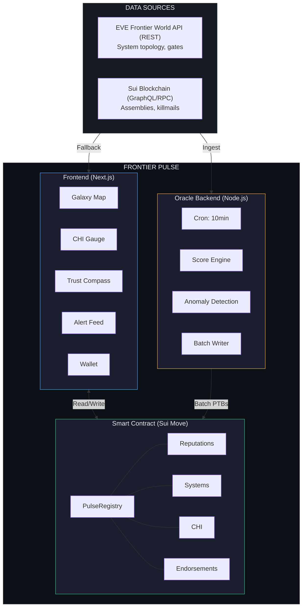
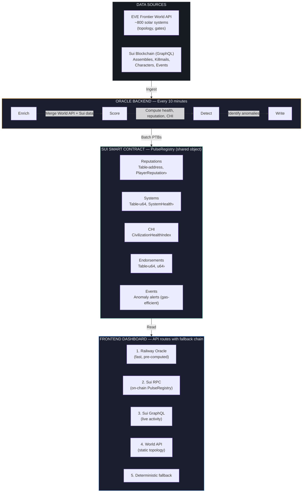

# Frontier Pulse

**Real-time civilization health monitoring for EVE Frontier on the Sui blockchain.**

Frontier Pulse transforms raw game data and on-chain activity into actionable intelligence — tracking solar system health, player reputation, and civilization-wide metrics across the EVE Frontier universe. It provides a living dashboard that answers the question: *"Is this universe thriving or collapsing?"*

**Live App:** [frontier-pulse-nine.vercel.app](https://frontier-pulse-nine.vercel.app/)
**Documentation:** [docs-frontierpulse.vercel.app](https://docs-frontierpulse.vercel.app/)
**GitHub:** [github.com/EzraNahumury/Frontier-Pulse](https://github.com/EzraNahumury/Frontier-Pulse)

---

## Table of Contents

- [Overview](#overview)
- [Architecture](#architecture)
- [Project Structure](#project-structure)
- [Subprojects](#subprojects)
- [Key Features](#key-features)
- [Tech Stack](#tech-stack)
- [Quick Start](#quick-start)
- [On-Chain Addresses](#on-chain-addresses)
- [Data Flow](#data-flow)
- [Scoring System](#scoring-system)
- [Deployment](#deployment)
- [Hackathon](#hackathon)
- [Team](#team)
- [License](#license)

---

## Overview

EVE Frontier is a blockchain-based space survival MMO where thousands of players build, trade, fight, and cooperate across a persistent universe. But the game world generates no built-in way to measure its own health — no dashboard, no reputation layer, no civilization-level metrics.

**Frontier Pulse** fills that gap with three layers:

| Layer | Name | Purpose |
|-------|------|---------|
| Data Layer | **Pulse Layer** | Ingests real-time data from the EVE Frontier World API and Sui blockchain |
| Compute Layer | **Agora Engine** | Scores system health, player reputation, and civilization health (CHI) |
| Presentation Layer | **Vital Signs** | Interactive galaxy map, trust compass, CHI gauge, alert system |

All computed scores are written on-chain to a shared Sui smart contract, making them verifiable, composable, and available to other dApps.

---

## Architecture



---

## Project Structure

```
SUI_FRONTIER/
│
├── fe_frontierpulse/       # Frontend dashboard (Next.js 16)
│   ├── app/                #   Pages, API routes, components
│   ├── lib/                #   Data fetching, types, state
│   └── README.md
│
├── oracle_backend/         # Oracle backend service (Node.js)
│   ├── src/                #   Cron scheduler, scoring, Sui writer
│   └── README.md
│
├── smartcontract_FP/       # Sui Move smart contract
│   ├── sources/            #   frontier_pulse.move
│   ├── tests/              #   24 test cases
│   └── Readme.md
│
├── docs_fp/                # Documentation site (Next.js 16)
│   ├── app/(docs)/         #   16 documentation pages
│   ├── components/docs/    #   Search, diagrams, navigation
│   └── README.md
│
├── pitch_deck/             # Interactive pitch deck (Next.js 16)
│   ├── app/components/     #   22 scroll-driven sections
│   └── README.md
│
└── Readme.md               # This file
```

---

## Subprojects

### [Frontend Dashboard](fe_frontierpulse/README.md)

Real-time civilization health monitoring interface. Features an interactive 2D galaxy map of ~800 solar systems, Civilization Health Index gauge, player reputation profiles, anomaly alerts, and Sui wallet integration for on-chain endorsements.

**Stack:** Next.js 16 · React 19 · Tailwind CSS 4 · @mysten/sui · @mysten/dapp-kit · Zustand
**Deploy:** Vercel

### [Oracle Backend](oracle_backend/README.md)

Scheduled daemon that runs every 10 minutes to fetch live data from the EVE Frontier World API and Sui blockchain, compute health/reputation/CHI scores using the Agora Engine, and write results to the smart contract via batched Programmable Transaction Blocks.

**Stack:** Node.js · TypeScript · @mysten/sui · node-cron
**Deploy:** Railway

### [Smart Contract](smartcontract_FP/Readme.md)

Sui Move smart contract providing the on-chain data layer. Stores player reputation profiles (5D trust compass), system health snapshots, the global Civilization Health Index, and community endorsements in a shared `PulseRegistry` object.

**Stack:** Move 2024 · Sui Framework
**Network:** Sui Testnet

### [Documentation](docs_fp/README.md)

Comprehensive documentation portal with 16 pages covering architecture, APIs, scoring algorithms, deployment guides, and a 90+ term glossary. Features full-text search (Ctrl+K), interactive architecture diagrams, and auto-generated table of contents.

**Stack:** Next.js 16 · Framer Motion · Tailwind CSS 4
**Deploy:** Vercel

### [Pitch Deck](pitch_deck/README.md)

Cinematic scroll-driven presentation showcasing the project. 10 full-viewport sections with neural network canvas background, scroll-snap navigation, parallax effects, and persona-based demo flows.

**Stack:** Next.js 16 · Framer Motion · Canvas API
**Deploy:** Vercel

---

## Key Features

### Galaxy Visualization
- Interactive 2D canvas star map with ~800 solar systems
- Color-coded by health status: Healthy (green), Stressed (amber), Hostile (red)
- Zoom, pan, click-to-select, and filter by trust level

### Civilization Health Index (CHI)
- 6-component weighted health metric (0–100)
- Sub-indices: Economic Vitality, Security, Growth, Connectivity, Trust, Social Cohesion
- Diagnosis labels: Flourishing → Thriving → Stable → Stressed → Declining → Collapsing

### Player Trust Compass
- 5-dimensional reputation profile per wallet address
- Dimensions: Reliability, Commerce, Diplomacy, Stewardship, Volatility
- Archetype classification: Civilization Builder, Trusted Trader, Diplomat, Warlord, Wildcard, Newcomer

### Anomaly Detection
- Rule-based alert system with 5 severity levels (Critical → Info)
- Alert types: Trust Collapse, Combat Hotspot, Blackout, Trade Spike
- Real-time feed with notification badges

### On-Chain Endorsements
- Any Sui wallet can endorse a star system on-chain
- One endorsement per wallet per system (double-endorsement prevention)
- Transparent community trust signal

### Wallet Integration
- Supports 5+ Sui wallets (Sui Wallet, Suiet, Ethos, Nightly, Martian)
- Auto-detect player's owned systems on connect
- Sign on-chain endorsement transactions

---

## Tech Stack

| Component | Technologies |
|-----------|-------------|
| **Frontend** | Next.js 16, React 19, TypeScript 5, Tailwind CSS 4, Zustand, Canvas API |
| **Oracle Backend** | Node.js, TypeScript, node-cron, @mysten/sui |
| **Smart Contract** | Move 2024, Sui Framework |
| **Blockchain** | Sui Testnet, @mysten/dapp-kit, Sui GraphQL |
| **Data Sources** | EVE Frontier World API (REST), Sui GraphQL, Sui JSON-RPC |
| **Documentation** | Next.js 16, Framer Motion, Lucide React |
| **Pitch Deck** | Next.js 16, Framer Motion, Canvas API |
| **Deployment** | Vercel (frontend, docs, pitch), Railway (oracle) |

---

## Quick Start

### 1. Smart Contract (Deploy First)

```bash
cd smartcontract_FP
sui move build
sui move test
sui client publish --gas-budget 100000000
```

Note the Package ID, AdminCap ID, and PulseRegistry ID from the output.

### 2. Oracle Backend

```bash
cd oracle_backend
npm install
cp .env.example .env
# Edit .env: set SUI_PRIVATE_KEY and contract addresses

npm run oracle:init    # Issue OracleCap (one-time)
# Copy ORACLE_CAP_ID to .env

npm run dev            # Start the oracle
```

### 3. Frontend Dashboard

```bash
cd fe_frontierpulse
npm ci
cp .env.example .env.local
# Default oracle URL is pre-configured

npm run dev            # http://localhost:3000
```

### 4. Documentation (Optional)

```bash
cd docs_fp
pnpm install
pnpm dev               # http://localhost:3000
```

### 5. Pitch Deck (Optional)

```bash
cd pitch_deck
npm install
npm run dev            # http://localhost:3000
```

---

## On-Chain Addresses

All addresses are on **Sui Testnet**.

| Object | Address |
|--------|---------|
| Package | `0x661842e6994fa10da8182c752711dd313895f8cf0dcc94eba6764beb6f43bbc9` |
| PulseRegistry | `0x945f1d589bae9c60e95b99c0f02a7fffb814db3772cb16467e5c683ea0bd32c4` |
| AdminCap | `0x2adb35c6ececb66b28fd178d246d3ef1b4f8c65fa5a3a7583192df91605da797` |
| UpgradeCap | `0x4d9d1182571536e4f2383a66a89622a66e0dfd114b23b89f1b0fb313c7d9ef46` |

### External Data Sources

| Service | Endpoint |
|---------|----------|
| EVE Frontier World API | `https://world-api-utopia.uat.pub.evefrontier.com` |
| Sui Testnet RPC | `https://sui-testnet.nodeinfra.com` |
| Sui GraphQL | `https://graphql.testnet.sui.io/graphql` |

---

## Data Flow



---

## Scoring System

### System Health (Per System)

| Metric | Weight/Formula |
|--------|---------------|
| Activity Level | `0.4 × players + 0.35 × infrastructure + 0.25 × combat` |
| Trust Level | `100 - combatRatio × 50 + infraBoost` |
| Local CHI | `activity × 40% + trust × 60%` |

### Player Reputation (Per Wallet)

| Dimension | Weight | Description |
|-----------|--------|-------------|
| Reliability | 25% | Behavioral consistency |
| Commerce | 25% | Trading honesty |
| Diplomacy | 20% | Cross-group cooperation |
| Stewardship | 20% | Infrastructure contribution |
| Volatility | 10% | Unpredictability (inverted) |

### Global CHI (Civilization-Wide)

| Sub-Index | Weight | Source |
|-----------|--------|--------|
| Economic Vitality | 20% | Trade volume, currency flow |
| Security Index | 15% | Kill rate, defense presence |
| Growth Rate | 15% | New deployments, expansion |
| Connectivity | 15% | Gate network density |
| Trust Index | 20% | Average reputation scores |
| Social Cohesion | 15% | Cross-alliance cooperation |

---

## Deployment

| Service | Platform | URL |
|---------|----------|-----|
| Frontend Dashboard | Vercel | [frontier-pulse-nine.vercel.app](https://frontier-pulse-nine.vercel.app/) |
| Documentation | Vercel | [docs-frontierpulse.vercel.app](https://docs-frontierpulse.vercel.app/) |
| Oracle Backend | Railway | [oracle-fp.up.railway.app](https://oracle-fp.up.railway.app) |
| Smart Contract | Sui Testnet | Package `0x6618...bbc9` |

See individual subproject READMEs for detailed deployment instructions.

---

## Hackathon

**EVE Frontier x Sui Hackathon 2026**
Theme: *"A Toolkit for Civilization"*

**Track:** External Tools (World API)
Build tools that connect to EVE Frontier through the World API — maps, dashboards, coordination platforms, analytics services, and new interfaces for interacting with the universe.

**Registration:** [deepsurge.xyz/evefrontier2026](https://deepsurge.xyz/evefrontier2026)

### Resources

| Resource | Link |
|----------|------|
| EVE Frontier Builders Docs | [docs.evefrontier.com](https://docs.evefrontier.com/) |
| Move / Sui Resources | [sui.io/developers](https://www.sui.io/developers) |
| World Contracts | [github.com/evefrontier/world-contracts](https://github.com/evefrontier/world-contracts) |
| EVE Vault (Wallet) | [github.com/evefrontier/evevault](https://github.com/evefrontier/evevault) |

---

## Team

**Frontier Pulse Team**

Built for the EVE Frontier x Sui Hackathon 2026.

---

## License

MIT
